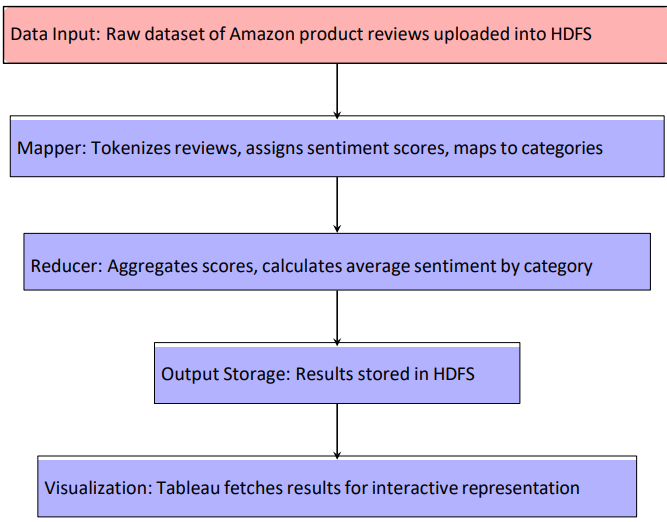

# Bigdata_project

# Sentiment Analysis on Product Reviews

## Overview
This project analyzes Amazon product reviews to uncover insights into customer satisfaction across various product categories. By leveraging Hadoop's distributed processing and sentiment analysis techniques, the project provides trends and actionable insights through interactive visualizations.

## Features
- **Sentiment Classification**: Tokenizes reviews and identifies sentiment as positive, neutral, or negative.
- **Key Phrase Extraction**: Extracts words/phrases linked to specific sentiments.
- **Sentiment Aggregation**: Computes sentiment distributions and average scores for each product category.
- **Data Visualization**: Generates interactive dashboards using Tableau to present trends and insights.

## Technology Stack
- **Programming Language**: Java (MapReduce implementation)
- **Framework**: Hadoop (HDFS for distributed storage)
- **Libraries**: NLTK or TextBlob (for sentiment scoring)
- **Visualization**: Tableau (for reporting and dashboards)

## Project Workflow
1. **Input**: Upload raw Amazon product reviews dataset into HDFS.
2. **Mapper**: Tokenizes reviews, assigns sentiment scores, and maps them to product categories.
3. **Reducer**: Aggregates sentiment scores, calculates distributions, and summarizes results for each category.
4. **Output**: Stores the processed sentiment data back into HDFS.
5. **Visualization**: Tableau retrieves data for creating interactive dashboards.

## Architecture Diagram

## Getting Started
1. Clone this repository:
   
